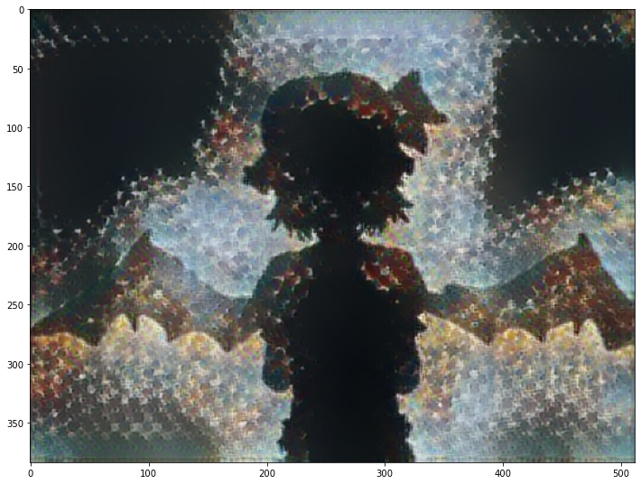

# VideoStyleTransfer

<!-- PROJECT SHIELDS -->
<!--
*** I'm using markdown "reference style" links for readability.
*** Reference links are enclosed in brackets [ ] instead of parentheses ( ).
*** See the bottom of this document for the declaration of the reference variables
*** for contributors-url, forks-url, etc. This is an optional, concise syntax you may use.
*** https://www.markdownguide.org/basic-syntax/#reference-style-links
-->
[![Contributors][contributors-shield]][contributors-url]
[![Forks][forks-shield]][forks-url]
[![Stargazers][stars-shield]][stars-url]
[![MIT License][license-shield]][license-url]

<!-- PROJECT LOGO -->
 

  

  <h3 align="center">Neural Network Style Transfer for Youtube using Python!</h3>

  

     Transfers an image style to an entire youtube video, using the power of neural networks! :brain: :face_with_head_bandage:
  

<!-- TABLE OF CONTENTS -->

  
<h2 style="display: inline-block">Table of Contents</h2>

  <ol>
    <li>
      <a href="#about-the-project">About The Project</a>
      <ul>
        <li><a href="#built-with">Built With</a></li>
      </ul>
    </li>
    <li><a href="#design">Design</a></li>
    <li><a href="#license">License</a></li>
    <li><a href="#contact">Contact</a></li>
    <li><a href="#acknowledgements">Acknowledgments</a></li>
  </ol>

<!-- ABOUT THE PROJECT -->
## About The Project

I always wanted to make my own unique BadApple!! version, but could never come up with an interesting way to do it that hadn't already been done. I decided to try and crank it out using a deep dream neural network, but it just took FOREVER on my hardware. My first time estimate to run the video was more than 2 years!!! Over time, I was able to slim down and speed up the program, scrapping a full neural net approach for the rapid speed of a pre-built model and style transfer! This changed *everything*, bringing the time estimate from 2 years to just 2 hours. :satisfied:

 

### Built With

* [Anaconda](www.anaconda.com)
* [youtube-dl](https://youtube-dl.org/)
* [tensorflow](https://www.tensorflow.org/)
* [ffmpeg](https://www.ffmpeg.org/)

<!-- DESIGN DESCRIPTION -->
## Design and Build

The jupyter notebook here runs in a special conda environment, to make sure all modules have proper dependencies. I also use a few simple add-ons for jupyter to make things easier for myself, which are totally optional. All of this code might run on Windows or Mac, but it was tested and designed to run on Linux (Ubuntu). The notebook has all instructions for setting up the conda environment, but in case you are not sure or can't read the notebook, here are the steps to set up the build. 

#Non Python Stuff

We need a way to get the youtube video frames. Easiest method is to use <code>youtube-dl</code> to download the video and use <code>ffmpeg</code> to extract the frames. This is handled inside the script, but can be useful as a standalone command line tool as well and I highly recommend it. 

#Conda Env Setup

This program is currently tested on Ubuntu with Python3.8.8. If this is your first time using conda environments, here is a basic walkthrough. Start with installing Anaconda. 

https://www.anaconda.com/

Once you have Anaconda installed, open a terminal and create a new conda environment for tensorflow. 

<code>conda create -n tf tensorflow</code>

Before activating the conda environment, we want to make sure we can use it on our notebook. The easy way to do this is to install nb conda kernels.

<code>conda install nb_conda_kernels</code> 

Now, activate your environment!

<code>conda activate tf</code>

Your module imports from now on, until you deactivate the environment, will be contained and version locked inside the environment, without disturbing other parts of your python installation. Machine learning tends to require specific versions of modules, to avoid running into incompatibility problems. To make sure we don't run into module version errors, lets install our modules by referring to their version. <code>youtube_dl</code> and <code>ffmpk</code> are for downloading youtube video, and extracting/stacking frames, respectively. 

<code>conda install tensorflow==2.6.0
conda install tensorflow-hub==0.12.0
conda install ipykernel==6.4.1
pip install youtube_dl
pip install ffmpy</code>

Now, the environment should be ready to use! I like to use one last modification to detect memory issues; machine learning is extremely memory intensive and can crash your computer if not managed properly. To see the memory usage of the notebook itself, add the jupyter resource usage tool. 

<code>conda install -c conda-forge jupyter-resource-usage</code>

<!-- LICENSE -->
## License

Distributed under the MIT License. See `LICENSE` for more information.

<!-- CONTACT -->
## Contact

Liam Plybon - lplybon1@gmail.com

Project Link: [https://github.com/blablabliam/VideoStyleTransfer](https://github.com/blablabliam/VideoStyleTransfer)

<!-- ACKNOWLEDGEMENTS -->
## Acknowledgements

* [StackOverflow](https://stackoverflow.com/)
* [GitHub](https://github.com/)

<!-- MARKDOWN LINKS & IMAGES -->
<!-- https://www.markdownguide.org/basic-syntax/#reference-style-links -->
[contributors-shield]: https://img.shields.io/github/contributors/blablabliam/VideoStyleTransfer.svg?style=for-the-badge
[contributors-url]: https://github.com/blablabliam/VideoStyleTransfer/graphs/contributors
[forks-shield]: https://img.shields.io/github/forks/blablabliam/VideoStyleTransfer.svg?style=for-the-badge
[forks-url]: https://github.com/blablabliam/VideoStyleTransfer/network/members
[stars-shield]: https://img.shields.io/github/stars/blablabliam/VideoStyleTransfer.svg?style=for-the-badge
[stars-url]: https://github.com/blablabliam/VideoStyleTransfer/stargazers
[issues-shield]: https://img.shields.io/github/issues/blablabliam/VideoStyleTransfer.svg?style=for-the-badge
[issues-url]: https://github.com/blablabliam/VideoStyleTransfer/issues
[license-shield]: https://img.shields.io/github/license/blablabliam/VideoStyleTransfer.svg?style=for-the-badge
[license-url]: https://github.com/blablabliam/VideoStyleTransfer/blob/master/LICENSE.txt
